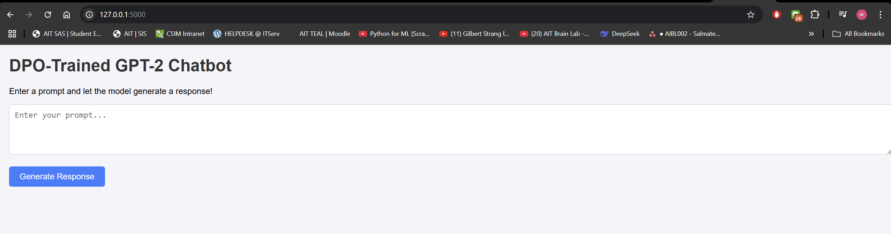

# A5-Optimization-Human-Preference
Enjoy reading my A5 Assignment for NLP class.

## Author Info
- Name: WIN MYINT@HTET WAI YAN HTUT (WILLIAM)
- Student ID: st125326

## Task 1. Finding a Suitable Dataset (0.5 point)

### Dataset
- **Name**: Anthropic HH-RLHF
- **Source**: [Hugging Face Datasets Hub](https://huggingface.co/datasets/Anthropic/hh-rlhf)
- **Description**: A dataset for reinforcement learning from human feedback (RLHF). It contains pairs of responses labeled as "chosen" (preferred) and "rejected" (non-preferred) based on human preferences.

### Preprocessing Steps
1. **Extract the Prompt, Chosen, Rejected**: In each row of data, `prompt`, `chosen`, and `rejected` fields were extracted.
2. **Tokenization**: The `prompt`, `chosen`, and `rejected` fields were tokenized using the GPT-2 tokenizer from Hugging Face.

## Task 2. Training a Model with DPOTrainer (2 points)

### Model
- **Model Name**: GPT-2
- **Source**: [Hugging Face Model Hub](https://huggingface.co/gpt2)

---

#### Training Configuration
The following hyperparameters were used for training:

| Hyperparameter                  | Value                     |
|---------------------------------|---------------------------|
| Learning Rate                   | 5e-5                      |
| Batch Size                      | 1                         |
| Gradient Accumulation Steps     | 1                         |
| Max Length                      | 512                       |
| Max Prompt Length               | 128                       |
| Max Target Length               | 128                       |
| Max Steps                       | 1000                      |
| Beta (DPO Hyperparameter)       | 0.1                       |

---

#### Training Results
The model was trained for **1000 steps** with the following results:

- **Training Loss**: 
  - At step 500: **0.000400**
  - At step 1000: **0.000000** (indicates the model converged well).
- **Validation Loss**: 
  - At step 500: **1.571434**
  - At step 1000: **1.847854** (slight increase, but still stable).
- **Rewards/Chosen**: 
  - At step 500: **-4.965383**
  - At step 1000: **-6.444730** (model assigns lower rewards to chosen responses over time).
- **Rewards/Rejected**: 
  - At step 500: **-6.498878**
  - At step 1000: **-8.412083** (model assigns even lower rewards to rejected responses).
- **Rewards/Accuracies**: 
  - At step 500: **0.640000**
  - At step 1000: **0.630000** (model maintains a good accuracy in distinguishing chosen vs. rejected responses).
- **Rewards/Margins**: 
  - At step 500: **1.533495**
  - At step 1000: **1.967352** (increased margin between chosen and rejected rewards, indicating better preference learning).
---

### Additional Metrics:
- **Training Runtime**: **132.6575 seconds**.
- **Training Samples per Second**: **7.538**.
- **Training Steps per Second**: **7.538**.
- **Epochs Completed**: **5.0**.

---

## Task 3: Pushing the Model to Hugging Face Hub (0.5 point)

### Model
- **Model Name**: DPO-trained GPT-2
- **Hugging Face Hub**: https://huggingface.co/htet22/dpo-trained-gpt2

### Steps
1. The model was trained using the **DPOTrainer** from the `trl` library.
2. The trained model was saved locally to `./dpo_trained_model`.
3. The model and tokenizer were uploaded to the Hugging Face Hub under the repository name `htet22/dpo-trained-gpt2`.

## Extra: Inference
- A function `generate_response` was implemented to generate responses from the trained model given a prompt.
- An example inference was performed using a sample prompt related to stealing from a convenience store.

## Task 4. Web Application Development (1 point)

How to run the web app
1. Pull the github repository
2. Run
```sh
python app/app.py
```
3. Access the app using http://127.0.0.1:5000

## How to use website
1. Open a web browser and navigate to http://127.0.0.1:5000.
2. Enter a sentence  in input field.
3. Click "Generate Response" button,
4. The response of the chat bot will be displayed on the screen.

## Screenshot of my web app



